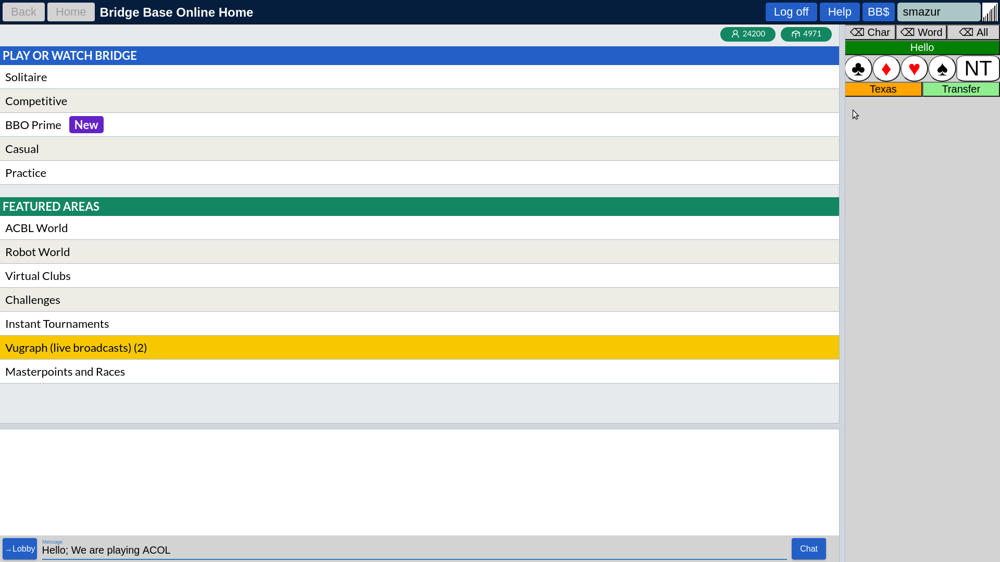

# BBOalert

Version : 5.0.1

The purpose of this browser extension is to reduce to the absolute minimum the manual operations due to the alerting procedure while playing bridge on BBO (www.bridgebase.com).

All you need in the beginning, is to install BBOalert and play normally. BBOalert will :
- record alerted calls
- alert automatically the recorded calls

Thereafter you can decide to use advanced features :
- efficient coding alerts using wild cards, RegEx expressions and user scripts
- declare conventions in optional blocks of code that can be turned ON and OFF
- declare which conventions you play with which partner
- Seat-dependent openings and development
- Vulnerability-dependent openings and development
- Keyboard and button shortcuts and abbreviations
- Full Disclosure BSS file support

If you like this tool, join the BBOalert users community on Facebook 

   https://www.facebook.com/groups/706384146770707/

Facebook should be used to report bugs and to propose enhancements.

We assume that you are familiar with BBO.

## Purpose

Tired of repeating the same story while alerting your bids on BBO? If yes, this browser extension is your friend.

During the bidding, conventional calls must be alerted and explained to the opponents. Playing artificial bidding systems on BBO is not practical because explaining each alerted call is time consuming and therefore frustrating for all participants.

BBOalert solves this problem. Artificial bidding sequences can be predefined in a table. Opponents get the explanation automatically and immediately. Explanations entered manually during the game are recorded for future use.

BBOalert has similar functionality as "Full Disclosure" which is no longer supported by BBO. One difference should be emphasized :

- "Full Disclosure" served the purpose of formal and complete description of a bidding system to be maintained on BBO server. The readability of the code is extremely low due to its complexity.
- BBOalert is strictly for personal use and should help to automate the disclosure of specific agreements. The simplicity of the code makes it readable.

The program can read "Full Disclosure" old BSS files. This will enable many users of the old Windows Flash version of BBO, to migrate to the HTML version without loosing the Full Disclosure functionnality.

BBOalert is useful for all types of BBO users :

- <b>casual players without a regular partner</b> : the common bidding system for all BBO users is SAYC. In such a case, only a few bids should be alerted 'pro forma' because all players are supposed to know SAYC basics. BBOalert will record each alerted bid and will automatically recall it if an identical situation occurs. You only alert once ! The program also allows you to define keyboard shortcuts for the frequently used expressions.
- <b>'natural' players with a regular partner</b> : SAYC is simple but inefficient in many situations. Adding some gadgets gives obvious advantages. BBOalert will help to document particular agreements. By using a common database with the partner, the explanation given to the opponents will be coherent. Practicing natural systems other than SAYC imply frequent alerting because of few, but essential differences.
- <b>'artificial' players with a regular partner</b> : playing an artificial system on BBO is an impossible task. Practically every bid should be alerted and explained. Frustrated opponents will quickly abandon your table. BBOalert enables the formal description of the system in all details and provides the opponents with correct information. Advanced features enable you to differentiate seat-dependent openings and to program different defense schemes depending on the conventions used by opponents.

## Installation

This extension can be installed using the link :

- Firefox : https://addons.mozilla.org/en-US/firefox/addon/bboalert
- Chrome  : https://chrome.google.com/webstore/detail/bboalert/bjgihidachainhhhilkeemegdhehnlcf
 
If you discover a serious bug in the program :

- report it to the BBOalert community on Facebook
- follow this link to revert to previous version

   - Firefox : https://addons.mozilla.org/en-US/firefox/addon/bboalert/versions
 
After you start BBO, the screen should look like this (note red/blue panel at the right) :

At the right side of the page, an additional 'BBOalert' tab is created. Clicking at this tab will toggle BBOalert panel display. This tab is only partially integrated with the regular BBO tabs :

- it shares the same display area
- selecting BBOalert tab will not deselect the open BBO tab
- selecting a BBO tab will turn the BBOalert tab off

The purpose of the buttons on the blue panel is :

- <b>Import</b> : to read new data from the clipboard
- <b>Append</b> : to append additional data from the clipboard
- <b>Export All</b> : write all data the clipboard
- <b>Export New</b> : write data related to tha manual alerts  to the clipboard
- <b>Export Log</b> : write log data to the clipboard. Log data should be provided with a bug report related to unexpected bid explanation retrieved from the data
- <b>Shortcuts</b> : enable button shortcuts

You will find detailed information later in this text. 

## How to use

The data should be stored in a CSV-formatted text file (CSV = Comma-Separated Value).

BBOalert uses the clipboard to read this file and to export eventual updates.

BBOalert requires the BBO in split screen mode (Account + Settings + Split Screen).

It is recommended to enable 'Confirm Bids' (Account + Settings + Confirm Bids). This will give you the opportunity to verify if the explanation is correct, before sending it to the opponents. The chat part of the long explanation text will be sent automatically.

At the first BBO session, you should :

- open the data file using your favorite text editor (see section : 'Data file format')
- select all text
- copy it to the clipboard
- press "Import" button on the BBO page 

<b>Hint : if you wish to erase the previously imported data, you have to import through clipboard the bare keyword BBOalert</b>

Data is saved in browser's cache and is recalled automatically at the next session. You should use 'Import' only if the data has changed or if the cache has been cleared.

<b>See GettingStarted.pdf for basic operations.</b>

'Append' button allows you to add code to the previously imported code. This allows splitting data into separate files for openings and development, overcalls, and the keyboard shortcut, as examples.  

<b>Only BBOalert native code can be appended, not BSS data.</b> However, appending BBOalert native data to the previously imported BSS data is allowed.

With the 'Export New' button you can copy the manual alerts to the clipboard and paste them at the end of your data file. The records imported this way will contain a timestamp and the deal number. You can retrieve from BBO the deals to review the manually alerted calls before committing the changes in your data file. 

## Recommended way of using BBOalert

BBOalert was designed initially for BBO in English and then adapted to other languages. If you discover incompatibilies of BBOalert with BBO in your language :

- switch to https://www.bridgebase.com/v3/?lang=en
- report the problem to stanmaz.git@gmail.com

We use the "You only alert once" principle. All you need to do in the beginning, is to play and alert if necessary. Your explanations will be recorded in the browser's cache and in the clipboard. The next time, when the same situation occurs, your call will be alerted automatically. Because cache is a temporary storage, you should paste the clipboard content from time to time in a text file as backup. With the 'Export' button the content of the clipboard will be overwritten by call manually alerted during the session.

It is more efficient to prepare data in advance with a editor and import this data into BBOalert. It is needless to code your entire system at once; it is a huge task. In each bidding system there are sequences which almost never occur.

As the program continues to record each manually alerted call for which no explanation has been found in the data file, your data will expand as needed.

I recommend to proceed this way :

- Instead of a simple text editor, create a new file in Google Docs beginning with the keyword BBOalert
- make this file "Shareable" with write access for your partner and send him the URL link. This guarantees to be always in sync.
- enter the code for opening bids and frequently used responses without using the advanced features (wildcards, RegEX and options)
- start playing using this data (remember : select all text + copy to clipboard before using the 'Import')
- alert your calls by hand if necessary. You can define shortcuts for the frequently used phrases and use them while entering explanations.
- at the end of the session, press the 'Export' button and paste the clipboard content at the end of the file. Your partner should do it too.
- review with your partner all newly created alerts and make the necessary corrections in the data file

For very large files, collaborative online code editors are preferred like https://cryptpad.fr/code/.

This way, the file is ready for the next session and will contain recently alerted calls.

The best method to learn BBOalert is to create a teaching table and to experiment with data.

## Alert button

Turning 'Alert' ON and OFF OFF will erase the explanation text. Thereafter you are free to enter eventually a new explanation text that will be recorded.

## Data file format

Comma separated value (CSV) format is used for each record.

The file must begin with the header record :

   BBOalert[,<user text>]
   
Where :

- BBOalert is mandatory keyword
- <user text> is optional free text. Typically used to express the version of the data. It will be displayed after data import. HTML codes   (line break) and <b> (bold text) are allowed. Example :
   
      BBOalert,My System Version <b>52</b>

Alerted calls should contain at least three text fields separated by commas :

    <context>,<call>,<explanation>[,optional text ignored by BBOalert]
    
where "context" is the bidding sequence preceding the "call". In those two fields we use two-character self-explaining tokens :

    1C 1D 1H 1S 1N Db Rd 2C 2D ....
    
To increase the readability of the code :
- we use '--' token for pass instead of 'Pa'
- outside of the data records free text is allowed for documentation purposes
- leading and trailing spaces and tabs are allowed in all fields.
- spaces are allowed in the context field

### Examples

#### Opening bid

    ,1N,12-14p balanced

Note :
- empty "context" field in the first record, because there is no bid before the opening
- Eventual passes preceding the opening are ignored

#### Development

    1N--,2C,Stayman can be weak
    1N--2C--,2D,No 4 card major

Note : -- codes mean pass by opponents

#### Development with opponents overcall

    1HDb,Rd,9+p misfit !H penalty redouble

#### Overcall

    1D,2D,Major two-suiter

### Advanced features

#### Seat-dependent openings

An empty "context" field means seat-independent opening. By using leading -- codes you can define seat-dependent opening. Placed after seat independent opening code, it will override it for the specified seat. Example
    
    ,1S,12-21p 5+!S,    This is the normal opening for all seats
    ----,1S,8-21 5+!S,    except after two passes. It can be weaker
    ----1S--,2C,Drury,    in such a case Drury is used

The alternative method of coding seat-dependent openings is presented in the section "Optional code".
 
#### Continued context

If the context is identical with the previous record, the '+' character can be used in the "context" field

Example : instead of code

    1N--,    2C,    Stayman
    1N--,    2D,    Texas !H
    1N--,    2H,    Texas !S
    
you can use code

    1N--,    2C,    Stayman
    +,       2D,    Texas !H
    +,       2H,    Texas !S

#### Continuation line

To increase the readability, it is possible to split a long record over more than one line. When a record ends with a backslash, it is cancatenated with the next record. Example : instead of 

      (1N--|2N--|2C--2D--2N..),               3C,     Puppet Stayman

you can write :

      (1N--|\
       2N--|\
       2C--2D--2N..),               3C,     Puppet Stayman

#### Long explanation text

If you need more than 39 characters to explain the alerted call, the solution is to place in the middle of the text the '#' character. It will split the text into two parts : the first will be used in the explanation field of the bidding box. The second part will be set in the chat box. The chat message should be sent to the opponents to complete the alert procedure.

Example :

    1S,2C,Please read chat for explanation#Natural overcall with at least a decent 5-card suit

The chat message will be sent automatically. Make sure that the chat messages are adressed to the opponents. Your partner is not supposed to read your auto-alert.

#### Wildcards

In the cases where the meaning of the call is not influenced by an eventual overcall, wildcards can be used in the "context" field. This can make the code more readable and more compact. Two characters are allowed as wildcard '*' or '_'. They match one character and have the same effect. In this example :

    1N__,2H,Transfer->!S
    
the code means : whatever the opponents do, 2H remains a mandatory transfer to 2S. Otherwise code should be provided for all possible overcalls made by the opponents.

#### Regular Expressions - RegEx

Both, "context" and "call", fields can be also formatted as regular "RegEx" expression in the process of matching with the actual bidding context.

RegEx can be used in two forms :

- explicit by encopassing the string between slashes : the matched strings may have different length (partial match)
- implicit without slashes : the matched strings should be of the same length (full match)

RegEx is a very complex mechanisme, but in BBOalert we use primarily one type of expression : groups of string matching patterns. The example below can be used as template :

      (1N--|2N--|2C--2D--2N..),               3C,     Puppet Stayman

This means that 3C call is defined in one record, instead of 3, as Puppet Stayman in three similar situations :
- after 1NT opening
- after 2NT opening
- after 2C-2D-2NT sequence

Further development can be coded as :

      (1N--3C--|2N--3C--|2C--2D--2N--3C--),       3D,    at least one 4 card major
      +,                                          3H,    5 card !H
      +,                                          3S,    5 card !S
      +,                                          3N,    no 4+ card major

For matching a single character, brackets should be used as in the example, where after either 1H or 1S opening, Jacoby 2NT raise is used :

      1[HS]--,2N,+12HCP and 4+ card fit

Asterisk wild card must be avoided in the regular expression. It matches strings of any length and will lead to unpredictibles results. If used, asterisk (and also underscore) will be internally converted to a dot (single character match).

If the ‘context’ field starts and ends with a slash, it is interpreted as a pure RegEx. Any regular expression is allowed, but 4 patterns are relevant for context matching

      //                            match any string
      /^startString/                match starting string
      /endString$/                  match ending string
      /^startString.*endString$/    match both
      /^String$/                    exact match

Examples :

      //,4N,Blackwood 5 key cards               ,after any bidding sequence 4NT is Blackwood
      /^1N/,4N,Quantitative slam try            ,except after 1NT opening
      /4N--$/,5C,1 or 4 key cards               ,response to Blackwood
      /4N--$/,5D,0 or 3 key cards
      /4N--$/,5H,2 key cards without trump Queen
      /4N--$/,5S,2 key cards with trump Queen
      /Db$/,--,to play doubled                  ,in any case pass after double is to play
      /Db$/,Rd,forcing; may be SOS              ,but redouble is forcing
      /^(1N|1N----)$/,Db,for penalties

Wildcards and regular expressions are powerfull features to get more compact code, but must be used carefully.

### User definable scripts

To use this feature the knowledge of RegEx and JavaScript is required.
Portions of the text can be replaced by the result returned by a user definable script. The script name is enclosed between two % characters.

Scripts may be used in fields :
- bidding context
- explanation text
- shortcut text
- button text

An example of data file :

      BBOalert
      Script,X,R = C.match(makeRegExp(CR))[1];
      Script,Y,R = C.match(makeRegExp(CR))[2];
      1([HS])--,2N,+12HCP and 4+!%X%
      1([HS])2([CD]),2N,11-12HCP misfit !%X% stopper !%Y%

Note : X and Y are arbitrary script names,and there are no specific limitations.

- The script should use variables :
   - CR : <context> field
   - C : actual bidding context
   - BR : <call> field
   - B : actual call (bid)
   - R : string to be returned
- The script may use the makeRegExp function, which transforms the string into a RegExp object. BBOalert wildcards _ and * will be replaced by dots.
- The script may be of any complexity :
- Each statement must end with ;
- To span the script over multiple lines \ should be used at the end of the line

### Optional code

Almost everyone on BBO is using the SAYC bidding system. But SAYC is not the world standard and some opponents will use another bidding system such as ACOL or French Standard. If you play on BBO with your partner to practice a sophisticated defense system - with particular agreements that depend on the conventions used by the opponents - you must be able to switch on-the-fly between different defense options during the game.

To solve this problem, the keyword 'Option' followed by the option name are used. The optional block of code is ended by another optional block or by bare 'Option' keyword. The selectable options will be displayed at the left side of the screen.

The subsequent options with the common prefix word will be grouped automatically. Within the group only one option can be selected to avoid conflicting codes. You are free to disable any option. Initially the first member of each group is enabled.

It is recommended to provide all overcalls in optional code blocks for each possible opening. This will allow you to unselect portions of code if necessary.

Optional blocks of data can be used also for :
- vulnerability-dependent openings by using @n or @v tags (our vulnerability) or @N or @V (opponent's vulnerability)
- seat-dependent openings by using @1 @2 @3 and @4 tags. Seat dependent overcalls must be coded explicitely as in the example :

        --1D,1H,<explanation text>

This is 3rd seat overcall not 3rd seat opening. 

The selection is done automatically if the block name contains any @ tag. This selection can be then manually overridden by the user during the game. Combining tags is allowed.

Spaces should be avoided in the option names containing @ tags. I recommend to use underscores instead.

In this example :

    Option,Opening_@v@3@4

the option will be enabled if vulnerable in 3rd or 4th seat.

Example :

    Option,NT 15-17
        1N,Db,any 6 card suit (DONT)    
    Option,NT 12-14
        1N,Db,for penalties
    Option,2H weak
        ... code specific for the defense against weak-2 opening
    Option,2H weak 5!H and 4+m
        ... code specific for the defense against Muiderberg opening
    Option,MyOpenings_@n
        ,1N,12-14 balanced
    Option,MyOpenings_@v
        ,1N,15-17 balanced
    Option

In this example three separated groups of options are created.

Options can contain also other types of records (Shortcut, Button, Trusted, Untrusted, Script, Alias). Those records will be active only if the option is enabled.

### Partnership options

Let us assume that you play different conventions with different partners. The option selector enables you to use certain options only when playing with a given partner. Example : you play weak NT with John and standard NT with Joe. This affects the NT rebid after the opening in a minor. The BBO user-id's of your partners can be specified in supplementary fields of the Options record. More than one name is allowed separated by a comma. Sample data :

      Option,  1NT 12-14,  John
      ,  1N,   12-14p balanced
      1[CD]--1*--,   1N,   balanced 15-17p
      Option,  1NT 15-17,  Joe
      ,  1N,   15-17p balanced
      1[CD]--1*--,   1N,   balanced 12-14p
      Option

If you choose John as partner the 1NT 12-14 option will be enabled and 15-17 disabled as :

When the user-id specified with an option fits the user id of your actual partner, the option is activated automatically. If you play with a partner who is not specified with any option, you may choose options manually (first Select All) or select the options of another partner.

It is possible to disable all options by chosing 'Select-None' from the dropbox. This feature can be used to disable also your entire bidding system if you declare it as an option.

### Trusted code

The code between the keywords 'Trusted' and 'Untrusted' will not require to be confirmed, even if 'Confirm Bids' toggle switch is ON. The number of occurences of trusted code blocks is not limited. In the example below, the explanation of 1C and 1D opening will be sent immediately, whereas 1N will required confirmation by pressing the OK button.

      Trusted
      ,1C,16+HCP any distribution
      ,1D,11-15HCP not 5 card major
      Untrusted
      ,1N,13-15HCP balanced

### Keyboard Shortcuts

Shortcut format :

    Shortcut,<token>,<full text>
    
In this example :

    Shortcut,TH,Texas->!H
    
TH string will be immediately expanded to the "Texas->!H" during text entry in the Message or Explanation text box. The tokens can be of any length , but we advise to use uppercase two-character tokens to avoid confusion during normal text entry.

You are also allowed to define Alt-key shortcuts as shown in this example :

    Shortcut,AltA,this text will be inserted if you press Alt-A key

The \n token within the shortcut text will split it and each part will be sent immediately. Example :

   Shortcut,WC,Welcome\nwe are playing SAYC\nItalian discard\n
   
This should be used only in the chat box only to increase the readabilit of the message by subdividing it separate lines. 

Note : check for potential conflicts with Alt key shortcuts of the browser.

### Button Shortcuts

Shortcuts can be defined as buttons displayed on a panel. Pressing a button will have the same effect as keyboard shortcut. The panel is disabled by default. To enable it press 'Shortcut' button on the blue panel. It will turn from red to green. The button panel will be displayed when clicking the explanation or chat entry text field. Clicking again will toggle button panel display.

At the top of the panel three buttons are predefined to erase single character, word the whole line of text.

The data format is similar to keyboard shortcuts :

   Button,<token>,<full text>[,optional properties]
   
This will create a button with <token> label. Pressing the button will append <full text>
   
Example

   Button,Hello,Hello; We are playing ACOL
   
You don't need to duplicate keybord shortcuts into buttons. Keyboard shortcuts will be displayed together with button shortcuts.

The default button properties are :
- width=50% (25% for keyboard shortcuts)
- backgroundColor=white
- color=black

You can override the defaults with the optional properties. Properties should be separated by a space character. Properties can be also appplied to keyboard shortcuts. Example :

    Button,Hello,Hello; We are playing ACOL,width=100% backgroundColor=green color=white
    Button,♣, !C,width=18% fontSize=40px borderRadius=100%
    Button,♦, !D,width=18% fontSize=40px borderRadius=100% color=red
    Button,♥, !H,width=18% fontSize=40px borderRadius=100% color=red
    Button,♠, !S,width=18% fontSize=40px borderRadius=100%
    Button,NT, NT,borderRadius=20% width=28% fontSize=40px
    Button,Texas,Texas,width=50% backgroundColor=orange
    Button,Transfer,Transfer,width=50% backgroundColor=lightgreen
    
  

The list of color names can be found on page :
https://www.w3schools.com/colors/colors_names.asp

The full list of property names (only a few apply to buttons) :
https://www.w3schools.com/jsref/dom_obj_style.asp

### Alias

The format os an alias record is :

      Alias,<string1>,<string2>
      
If any explanation text record contains <string1> it will be replaced by <string2>. Following rules apply :

- An alias must be defined before it is used
- <string1> must not be necessarily unique
- Always the last match is used for string substitution
- The aliases should be sorted from the shortest to the longest <string1>
- In both strings case and spaces matter (leading and trailing). Note : to keep the visual control of trailing spaces in <string2> a comma may be added at the end of the record.

The main purpose of aliases is to solve the problem of national bridge events where the usage of the local language is required. Maintaining two different data files for two different languages is not practical. The aliases can be used to translate expressions depending on the selected language. Example of code :

      BBOalert
      Option,Lang EN
      Shortcut,HH,Hello
      Option,Lang FR
      Shortcut,HH,Bonjour
      Alias,balanced,régulier
      Alias,game forcing,forcing manche
      Option,MySystem
      ,1N,15-17p balanced
      ,2C,game forcing
      
Sorting aliases by <string1> length is important (remember : last match counts). In the example

      Alias,without,sans
      Alias,with,avec

The word ‘without’ will be translated to ‘avecout’ which is wrong. Reversing the order will give the correct result.

Aliases may be used also in the bidding context field. Example :

      Alias,#,2C--2D--
      #2N--,3C,Puppet Stayman

Is equivalent to

      2C--2D--2N--,3C,Puppet Stayman

The same alias may be reused later in the file with a different definition.

This technique may be useful when the same long context prefix is used at different places. The alias may not be combined with + in the same context field.

### Full Disclosure BSS file support

BBOalert can read BSS files in the same way as native BBOalert :

- open the BSS file with a text editor
- select all text and copy it to the clipboard
- in BBOalert use 'Import' button.

BBOalert converts BSS data internally to the BBOalert native format. Vulnerability-dependent calls are supported (@n or @v tag in the optnion name). Seat-dependent openings are set in separate optional blocks (@1 @2 @3 or @4 tag in the option name).

The converted data is available in the clipboard. You can paste it into the text editor and use it as a starting point for further modifications. Another possible scenario is to keep importing the original BSS file and to create an overriding code (in BBOalert native format) in a separate file to be appended later ('Append' button).

### Quick Undo

Clicking at the header of the auction box will generate an Undo command

This is much faster, than selecting Undo from the menu.

### Using BBO convention card to share data

To share the data with your partner via the BBO server :

- make a convention card (Account+Convention Card) using "SAYC - Standard American Yellow Card" or "Simple Modern ACOL" as template
- open it for editing
- make is shareable by filling your partner's name
- press "Get from BBOalert" to append your data to the text in the "Defensive Carding" text
- press "Save Changes"

Note : while editing the "Defensive Carding" text, do not alter anything beyond the large square character which separates your text from the BBOalert data.

This convention card together with the BBOalert data will become available for your partner. To load data into BBOalert

- open the convention card for editing
- press "Send to BBOalert"

## Release notes 

### Version 2.10

Bug fix : long explanation text split by # character is now correctly displayed on first and subsequent usages

Bug fix : options are now correctly initialized after the data is retrieved from cache

New feature : the chat message part of a long explanation text is automatically sent when the bid is confirmed (OK button of the bidding box)

New feature : Multiline support for chat message shortcuts : \n in the shortcut text will split the whole message and each part will be sent immediately. Typical application : long text as prealert. Not to be used with shortcuts used for bid explanation.

### Version 3.0.1

- options selector added (see 'Partnership options' section)
- manual alerts are recorded in the cache (see 'Recommended way of using BBOalert' section)
- the whole data is kept in the clipboard until overwritten by 'Export' command or by an external application
- Alert button turned automatically ON. When turned OFF, the call explanation is erased. (see 'Alert button' section)
- backslash to split long records  (see 'Continuation line' section)

If you discover a serious bug in the program :

- report it to the BBOalert community on Facebook
- revert temporarily to previous version (see 'Installation' section)

### Version 3.0.2

- bug fix : apparently intermittend fault in @ tagged option selection

### Version 3.1

- bug fix : automatic vulnerability detection not working after the opening of the Hitory tab
- mamory leak

- new feature : new user interface integrated with the BBO tabs
- new feature : export of log data

### Version 3.2 skipped
### Version 3.3

New features
- RegEx in the ‘call’ field
- full RegEx support
- Trusted code attribute
- Quick undo
- Touch screen support

### Version 3.4

Bug fixes
- Forced page reload at Logoff is removed
- Partner selection of @-tagged options

New feature
- User definable scripts

## Version 3.5

New feature :

- recording of post-mortem alerts. Explanations after the call is made, are recorded if the text entry is terminated by pressing OK. If the text entry is terminated by Enter key, the alert will be sent to the opponents but not recorded.

## Version 3.6

Bug fixes :

- Certain combinations of automatic option selection were impossible. To fix it, the mechanism of option selection has been reworked.
- Automatic confirmation of trusted bids is delayed to avoid race problems when switching from untrusted to trusted bid
- Blank partner selection is ignored in the dropdown box

New features :

- User message displayed at data import 
- Opponent’s vulnerability option tags added : @N and @V
- Saving BBOalert data with the BBO convention card
- User scripts supported in the shortcut text

## Version 3.6.1

Bug fix :

The new algorithm for option management requires a small modification of the data file. Without entering in technical details, I recommend to replace spaces by underscores in the option names containing @ tags. Example :

    Option,Opening @n
    Option,Opening @v

Should be :

    Option,Opening_@n
    Option,Opening_@v

The BSS file converter has been modified and produces underscores in option names.

## Version 3.6.2

Bug fix :
- linefeed character added (if missing) at the end of the data after import

## Version 3.6.3

Bug fix:
- incorrect mutual exclusive option initialization when partner selected

## Version 4.0

New feature :
- button shortcuts (see <b>Button shortcuts</b> section)
- scripts allowed in the biding context field

## Version 4.0.0.2

Bug fix :
- BBOalert crash due to the modification of HTML data by BBO

## Version 5.0

New features :
- The optional text in the BBOalert header (first line of the code) may contain HTML codes \  for line break and \<b> for bold font
- When the opponents ask supplementary explanation, the text entry box is displayed at the same place as the bidding box instead of right-upper corner. The box is draggable.
- All records types (e.g. Button Shortcut or Script) are supported within options. It means that when a record is inside an option it will be active only when the option is enabled.
- New record type is supported :  Alias,\<string1>,\<string2> If any alert record contains \<string1> it will be replaced by \<string2>

## Version 5.0.1

Bug fix :
- performance issue

