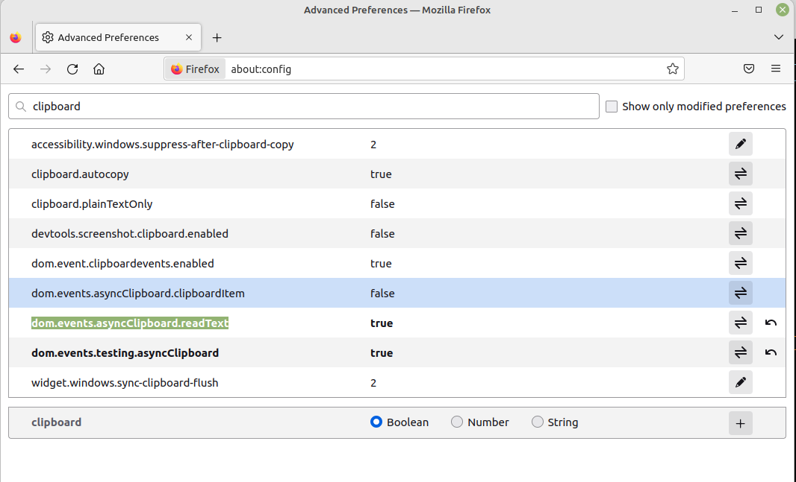
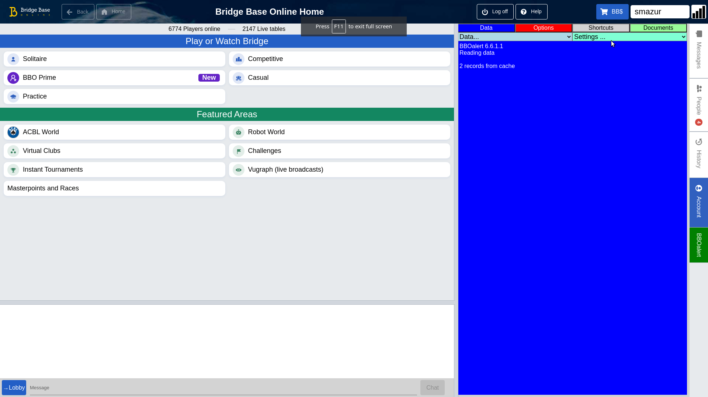
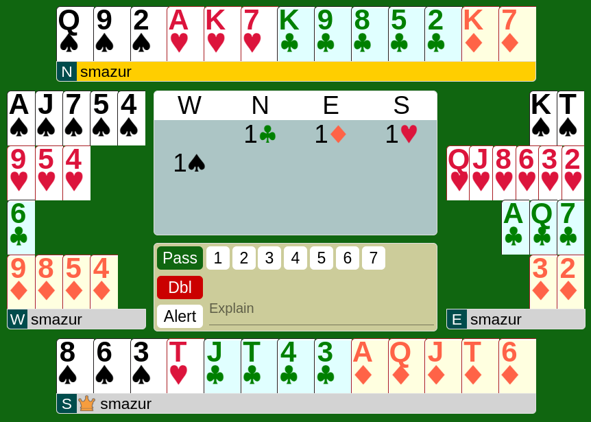
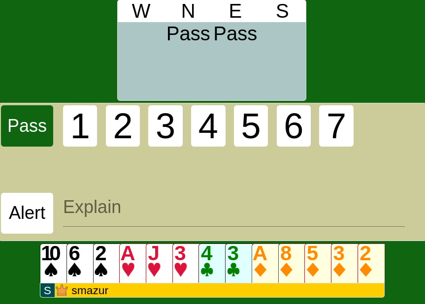
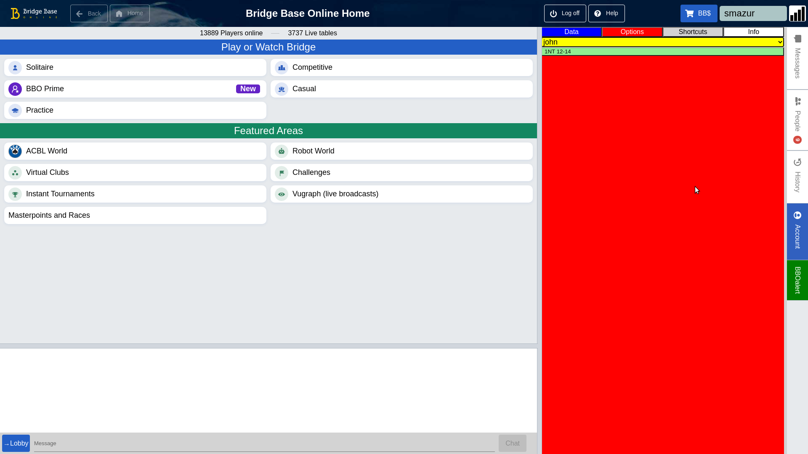
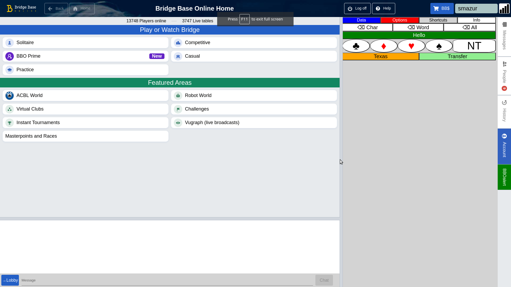

# BBOalert

Version : 9.0.0.4

**Table Of Content**

  * [Purpose](#purpose)
  * [Installation](#installation)
  * [Menus](#menus)
  * [Data import/export](#data-importexport)
  * [Recommended way of using BBOalert](#recommended-way-of-using-bboalert)
  * [Alert button](#alert-button)
  * [Data file format](#data-file-format)
    + [Examples](#examples)
      - [Opening bid](#opening-bid)
      - [Development](#development)
      - [Development with opponents overcall](#development-with-opponents-overcall)
      - [Overcall](#overcall)
    + [Advanced features](#advanced-features)
      - [Seat-dependent openings](#seat-dependent-openings)
      - [Continued context](#continued-context)
      - [Markdown lists](#markdown-lists)
      - [Continuation line](#continuation-line)
      - [Long explanation text](#long-explanation-text)
      - [Wildcards](#wildcards)
      - [Regular Expressions - RegEx](#regular-expressions---regex)
    + [User definable scripts](#user-definable-scripts)
    + [Optional code](#optional-code)
    + [Partnership options](#partnership-options)
    + [Trusted code](#trusted-code)
    + [Auction control tags](#auction-control-tags)
    + [Keyboard Shortcuts](#keyboard-shortcuts)
    + [Button Shortcuts](#button-shortcuts)
    + [Alias](#alias)
    + [Full Disclosure BSS file support](#full-disclosure-bss-file-support)
    + [Using BBO convention card to share data](#using-bbo-convention-card-to-share-data)
    + [Web storage support](#web-storage-support)
      - [Google Docs](#google-docs)
      - [Google Drive](#google-drive)
      - [OneDrive](#onedrive)
      - [Github](#github)
      - [Dropbox](#dropbox)
      - [Blogger](#blogger)
      - [BBOalert data](#bboalert-data)
      - [Scripts](#scripts)

For recent changes see actual release notes :

https://docs.google.com/document/d/e/2PACX-1vQ_8Iv9HbBj4nWDXSY_kHsW1ZP_4c4dbOVO0GLuObJc1vFu_TBg9oV6ZJXMWd_tLITOj7i6WaJBeZJI/pub

We assume that you are familiar with BBO.

BBOalert is a browser extension that minimizes manual operations due to the alerting procedure while playing bridge on BBO (www.bridgebase.com).

It records alerted calls and automatically alerts the recorded calls.

It offers advanced features such as :
- efficiently coding alerts using wild cards, RegEx expressions and user scripts
- declaring conventions in optional blocks of code that can be turned on and off
- declaring which conventions you play with which partner
- seat-dependent openings and development
- vulnerability-dependent openings and development
- keyboard and button shortcuts and abbreviations
- Full Disclosure BSS file support
- adding custom features using Javascript
- sharing your data using Google Drive, OneDrive, Dropbox or Github storage.

If you decide to use BBOalert, join the users community on Facebook : https://www.facebook.com/groups/706384146770707/

Facebook should be used to report bugs, propose enhancements and ask questions.

## Purpose

Tired of repeating the same story while alerting your bids on BBO? If yes, this browser extension is your friend.

During the bidding, conventional calls must be alerted and explained to the opponents. Playing artificial bidding systems on BBO is not practical because explaining each alerted call is time consuming and therefore frustrating for all participants.

BBOalert solves this problem. Artificial bidding sequences can be predefined in a table. Opponents get the explanation automatically and immediately. Explanations entered manually during the game are recorded for future use.

BBOalert has similar functionality as "Full Disclosure" which is no longer supported by BBO. One difference should be emphasized :

- "Full Disclosure" served the purpose of formal and complete description of a bidding system to be maintained on BBO server. The readability of the code is extremely low due to its complexity.
- BBOalert is strictly for personal use and should help to automate the disclosure of specific agreements. The simplicity of the code makes it readable.

The program can read "Full Disclosure" old BSS files. This will enable many users of the old Windows Flash version of BBO, to migrate to the HTML version without loosing the Full Disclosure functionnality.

BBOalert is useful for all types of BBO users :

- <b>casual players without a regular partner</b> : the common bidding system for all BBO users is SAYC. In such a case, only a few bids should be alerted 'pro forma' because all players are supposed to know SAYC basics. BBOalert will record each alerted bid and will automatically recall it if an identical situation occurs. You only alert once ! The program also allows you to define keyboard shortcuts for the frequently used expressions.
- <b>'natural' players with a regular partner</b> : SAYC is simple but inefficient in many situations. Adding some gadgets gives obvious advantages. BBOalert will help to document particular agreements. By using a common database with the partner, the explanation given to the opponents will be coherent. Practicing natural systems other than SAYC imply frequent alerting because of few, but essential differences.
- <b>'artificial' players with a regular partner</b> : playing an artificial system on BBO is an impossible task. Practically every bid should be alerted and explained. Frustrated opponents will quickly abandon your table. BBOalert enables the formal description of the system in all details and provides the opponents with correct information. Advanced features enable you to differentiate seat-dependent openings and to program different defense schemes depending on the conventions used by opponents.

## Installation

This extension can be installed using the link :

- Firefox : https://addons.mozilla.org/en-US/firefox/addon/bboalert<br>The following supplementary action is required to enable clipboard operations :
    - Open the about:config page and accept the security warnings
    - Search for the clipboard keyword
    - set **dom.events.asyncClipboard.readText** and **dom.events.testing.asyncClipboard** parameters to true
    


- Chrome  : https://chrome.google.com/webstore/detail/bboalert/bjgihidachainhhhilkeemegdhehnlcf
 
If you discover a serious bug in the program :

- report it to the BBOalert community on Facebook
- follow this link to revert to previous version

   - Firefox : https://addons.mozilla.org/en-US/firefox/addon/bboalert/versions
   - Chrome : see [installing Chrome extension from ZIP file](./oldChromeVersions)
 
After you start BBO, the screen should look like this (note red/blue panel at the right) :



At the right side of the page, an additional 'BBOalert' tab is created. Clicking at this tab will toggle BBOalert panel display. This tab is only partially integrated with the regular BBO tabs :

- it shares the same display area
- selecting BBOalert tab will not deselect the open BBO tab
- selecting a BBO tab will turn the BBOalert tab off

BBOalert creates four panels :

- "Data" : the default panel containing : 
   - "Data" menu for importing and exporting data
   - "Settings" menu for enabling/disabling features
   - text area to display program messages
- "Options" : to enable/disable user definable optional blocks of data
- "Shortcuts : to access user definable text shortcut buttons
- "Documents" : to display release notes and imported documents

The panels can be selected by clicking the corresponding buttons at the top of the panel.

### Menus

The "Data" menu contains commands related to the data input/output :

- <b>Paste (New)</b> : to read new data from the clipboard
- <b>Paste (Append)</b> : to append additional data from the clipboard
- <b>Clear</b> : to erase all data
- <b>Copy All</b> : write all data to the clipboard
- <b>Copy New</b> : write data related to tha manual alerts  to the clipboard
- <b>Copy Log</b> : write log data to the clipboard. Log data should be provided with a bug report related to unexpected bid explanation retrieved from the data

The "Settings" menu contains commands to enable/disable features :

- <b>Shortcuts</b> : if enabled, the "Shortcuts" panel will appear automatically at the start of text entry (chat or alert text)
- <b>Hover BBOalert Tabs</b> : if enabled, the BBOalert panels are selected by moving the mouse over the corresponding button at the top of the BBOalert panel
- <b>Hover BBO Tabs</b> : if enabled, the BBO tabs at the right side are selected by moving the mouse over the tab
- <b>Collapse Options</b> : if enabled, the mutually exclusive blocks of data are grouped together and only the selected block is shown. This feature is particullary usefull to save space on the panel when many blocks are defined
- <b>Disable recording</b> : if set, the manual alerts are not recorded
- <b>Disable auto-alerts</b> : if set, automatic alerting mechanism is disabled
- <b>Silent startup</b> : if set, BBOalert will remain hidden while starting the BBO session
- <b>BBOalert button</b> : if set, a button will be used instead of athe tab to toggle the BBOalert panel
- <b>Deferred alerts</b> : if set, automatic alert explanation will happen only on demand by opponents
  
You will find detailed information later in this text but before you continue to read it it is recommended to get familiar with the basic BBOalert functions by following the [tutorial](Tutorial/GettingStarted.pdf).

Through the "Plugin settings..." menu addional self-explanatory utilities can be enabled and configured. 
- <b>BBO event logging</b> : produces a CSV log file containing all relevant events with timing information. Can be usefull as evidence of slow play.
- <b>Modified suit colors</b> : allows customization of suit colors. [Standard HTML color names](https://www.w3schools.com/html/html_colors.asp) or rgb(red, green, blue) code may be used. Example for red : <b>rgb(255,0,0)</b>
  


- <b>Automatic prealert</b> : The text defined with the PREALERT shortcut will be sent as chat when opponents change. Instead of PREALERT you may use your own shortcut name.
- <b>Bidding timeout</b> : will automatically produce chat messages when the opponents exceed the defined time limits.
- <b>Miscellaneous simple scripts</b> :
    - <b>Enable chat timestamp</b> : adds a timestamp to each new chat message
    - <b>Move table left</b> : pushes the table area to the left side of the screen to maximize the space reserved to the BBOalert panel
    - <b>Large bidding box</b> : maximizes the size of the bidding box

    - <b>Modified OK button</b> : The OK text is replaced by the actually selected call for better control before confirming.
    - <b>Swap bidding buttons</b> : The OK button is moved to the left side of the bidding box, PASS, DBL, RDBLand ALERT buttons to the right side.
    - <b>Auto chat to opponents</b> : the chat destination will be automatically set to OPPONENTS between the auction begin and the last trick played. Thereafter it will be set back to TABLE.
    - <b>Disable alerts with casual partner</b> : automatic alerts will be disabled when you play with a partner not defined in any OPTION partnership.
    - <b>T for 10</b> : T will be used instead of 10 on card symbols.

## Data import/export

BBOalert uses the clipboard to import or export data. Using the clipboard instead of direct file access gives the user the freedom of choice of text editing tool. The code can be edited as a simple ASCII file or with any text processing tool like Word. To read the data from a file :

- open the data file using your favorite text editor (see section : 'Data file format')
- select all text (usually with Ctrl-A keystroke)
- copy it to the clipboard (usually with Ctrl-C keystroke)
- select "Paste (New)" from the "Data" menu on the blue BBOalert panel

## Recommended way of using BBOalert

- BBOalert requires the BBO in split screen mode (Account + Settings + Split Screen).

- It is recommended to enable 'Confirm Bids' (Account + Settings + Confirm Bids). This will give you the opportunity to verify if the explanation is correct, before sending it to the opponents. The chat part of the long explanation text will be sent automatically.

- Data is saved in browser's cache and is recalled automatically at the next session. You should use 'Paste (New)' only if the data has changed or if the cache has been cleared.

- 'Paste (Append)' command allows you to add code to the previously pasted code. This allows splitting data into separate files for openings and development, overcalls, and the keyboard shortcut, as examples.

- <b>Only BBOalert native code can be appended, not BSS data.</b> However, appending BBOalert native data to the previously imported BSS data is allowed.

- With the 'Copy New' command you can copy the manual alerts to the clipboard and paste them at the end of your data file. The records imported this way will contain a timestamp and the deal number. You can retrieve from BBO the deals to review the manually alerted calls before committing the changes in your data file. 

- BBOalert was designed initially for BBO in English and then adapted to other languages. If you discover incompatibilies of BBOalert with BBO in your language :

   - switch to https://www.bridgebase.com/v3/?lang=en
   - report the problem to stanmaz.git@gmail.com

We use the "You only alert once" principle. All you need to do in the beginning, is to play and alert if necessary. Your explanations will be recorded in the browser's cache and in the clipboard. The next time, when the same situation occurs, your call will be alerted automatically. Because cache is a temporary storage, you should paste the clipboard content from time to time in a text file as backup.

It is more efficient to prepare data in advance with a editor and paste this data into BBOalert. It is needless to code your entire system at once; it is a huge task. In each bidding system there are sequences which almost never occur.

You and your partner should use the same data. The simple but ineffcient method it to edit the data locally and share the file as mail attachment. The best way of sharing data is by using the cloud storage. See the "Web storage support" section for details.

## Alert button

Turning 'Alert' ON and OFF OFF will erase the explanation text. Thereafter you are free to enter eventually a new explanation text that will be recorded.

## Data file format

Comma separated value (CSV) format is used for each record.

The file must begin with the header record :

   BBOalert[,<user text>]
   
Where :

- BBOalert is the mandatory keyword
- <user text> is optional free text. Typically used to express the version of the data. It will be displayed after data import. HTML codes \<br> (line break) and \<b> (bold text) are allowed. Example :
   
      BBOalert,My System<br>Version <b>52</b>

Alerted calls should contain at least three text fields separated by commas :

    <context>,<call>,<explanation>[,optional text ignored by BBOalert]
    
where "context" is the bidding sequence preceding the "call". In those two fields we use two-character self-explaining tokens :

    1C 1D 1H 1S 1N Db Rd 2C 2D ....
    
To increase the readability of the code :
- we use '--' token for pass instead of 'Pa'
- outside of the data records free text is allowed for documentation purposes
- leading and trailing spaces and tabs are allowed in all fields.
- spaces are allowed in the context field

### Examples

#### Opening bid

    ,1N,12-14p balanced

Note :
- empty "context" field in the first record, because there is no bid before the opening
- Eventual passes preceding the opening are ignored

#### Development

    1N--,2C,Stayman can be weak
    1N--2C--,2D,No 4 card major

Note : -- codes mean pass by opponents

#### Development with opponents overcall

    1HDb,Rd,9+p misfit !H penalty redouble

#### Overcall

    1D,2D,Major two-suiter

### Advanced features

#### Seat-dependent openings

An empty "context" field means seat-independent opening. By using leading -- codes you can define seat-dependent opening. Placed after seat independent opening code, it will override it for the specified seat. Example
    
    ,1S,12-21p 5+!S,    This is the normal opening for all seats
    ----,1S,8-21 5+!S,    except after two passes. It can be weaker
    ----1S--,2C,Drury,    in such a case Drury is used

The alternative prefered method of coding seat-dependent openings is presented in the section "Optional code".
 
#### Continued context

If the context is identical with the previous record, the '+' character can be used in the "context" field

Example : instead of code

    1N--,    2C,    Stayman
    1N--,    2D,    Texas !H
    1N--,    2H,    Texas !S
    
you can use code

    1N--,    2C,    Stayman
    +,       2D,    Texas !H
    +,       2H,    Texas !S

#### Markdown lists

Bidding sequences can be coded in form a hierarchical lists. Markdown language unordered lists syntax apply. Example :

    ,1N,15-17p
    - 2C Stayman
        - 2D no 4-card major
            - 2H weak major two-suiter
    - 2D Transfer

Following rules apply : 

- Starting point of the tree is to be coded in the normal way (context,call,explanation)
- Indentation
    - Level 1 must start with a hyphen with no leading spaces
    - Level N indentation = (N-1)x4 spaces (exactly multiple of 4) and a hyphen
-    Within the list the call and its explanation should be separated by space(s) and/or tab(s), not by a comma
-    By default opponents are assumed to pass. If they don’t, add their bid before your bid separated by a comma. Example of a 2C response after RHO’s double :

    ,1N,15-17p
    - Db,2C to play

- Asterisk may be used instead of hyphen

#### Continuation line

To increase the readability, it is possible to split a long record over more than one line. When a record ends with a backslash, it is cancatenated with the next record. Example : instead of 

      (1N--|2N--|2C--2D--2N..),               3C,     Puppet Stayman

you can write :

      (1N--|\
       2N--|\
       2C--2D--2N..),               3C,     Puppet Stayman

#### Long explanation text

If you need more than 69 characters to explain the alerted call, the solution is to place in the middle of the text the '#' character. It will split the text into two parts : the first part will be used in the explanation field of the bidding box. The second part will be set in the chat box. In the second part <br> code may be used as line break to split the text over multiple lines when it is sent.

Example :

    1S,2C,Please read chat for explanation#Natural overcall with at least a decent 5-card suit

The chat message will be sent automatically. Make sure that the chat messages are adressed to the opponents. Your partner is not supposed to read your auto-alert.

#### Wildcards

In the cases where the meaning of the call is not influenced by an eventual overcall, wildcards can be used in the "context" field. This can make the code more readable and more compact. Two characters are allowed as wildcard '*' or '_'. They match one character and have the same effect. In this example :

    1N__,2H,Transfer->!S
    
the code means : whatever the opponents do, 2H remains a mandatory transfer to 2S. Otherwise code should be provided for all possible overcalls made by the opponents.

#### Regular Expressions - RegEx

Both, "context" and "call", fields can be also formatted as regular "RegEx" expression in the process of matching with the actual bidding context.

RegEx can be used in two forms :

- explicit by encopassing the string between slashes : the matched strings may have different length (partial match)
- implicit without slashes : the matched strings should be of the same length (full match)

RegEx is a very complex mechanisme, but in BBOalert we use primarily one type of expression : groups of string matching patterns. The example below can be used as template :

      (1N--|2N--|2C--2D--2N..),               3C,     Puppet Stayman

This means that 3C call is defined in one record, instead of 3, as Puppet Stayman in three similar situations :
- after 1NT opening
- after 2NT opening
- after 2C-2D-2NT sequence

Further development can be coded as :

      (1N--3C--|2N--3C--|2C--2D--2N--3C--),       3D,    at least one 4 card major
      +,                                          3H,    5 card !H
      +,                                          3S,    5 card !S
      +,                                          3N,    no 4+ card major

For matching a single character, brackets should be used as in the example, where after either 1H or 1S opening, Jacoby 2NT raise is used :

      1[HS]--,2N,+12HCP and 4+ card fit

Asterisk wild card must be avoided in the regular expression. It matches strings of any length and will lead to unpredictibles results. If used, asterisk (and also underscore) will be internally converted to a dot (single character match).

If the ‘context’ field starts and ends with a slash, it is interpreted as a pure RegEx. Any regular expression is allowed, but 4 patterns are relevant for context matching

      //                            match any string
      /^startString/                match starting string
      /endString$/                  match ending string
      /^startString.*endString$/    match both
      /^String$/                    exact match

Examples :

      //,4N,Blackwood 5 key cards               ,after any bidding sequence 4NT is Blackwood
      /^1N/,4N,Quantitative slam try            ,except after 1NT opening
      /4N--$/,5C,1 or 4 key cards               ,response to Blackwood
      /4N--$/,5D,0 or 3 key cards
      /4N--$/,5H,2 key cards without trump Queen
      /4N--$/,5S,2 key cards with trump Queen
      /Db$/,--,to play doubled                  ,in any case pass after double is to play
      /Db$/,Rd,forcing; may be SOS              ,but redouble is forcing
      /^(1N|1N----)$/,Db,for penalties

When the <call> field contains a regex group containing a list of possible bids with different explanations, the explanations can be listed in the same one record in supplementary comma separated fields.

	Example : 

	1N--,(2C|2D|2H|2S),Stayman,Texas !H,Texas !S,Texas !C

Wildcards and regular expressions are powerfull features to get more compact code, but must be used carefully.

### User definable scripts

To use this feature the knowledge of RegEx and JavaScript is required.
Portions of the text can be replaced by the result returned by a user definable script. The script name is enclosed between two % characters.

Scripts may be used in fields :
- bidding context
- call
- explanation text
- shortcut text
- button text

An example of data file :

      BBOalert
      Script,X,R = C.match(makeRegExp(CR))[1];
      Script,Y,R = C.match(makeRegExp(CR))[2];
      1([HS])--,2N,+12HCP and 4+!%X%
      1([HS])2([CD]),2N,11-12HCP misfit !%X% stopper !%Y%

Note : X and Y are arbitrary script names,and there are no specific limitations.

- The script should use variables :
   - CR : <context> field
   - C : actual bidding context
   - BR : <call> field
   - B : actual call (bid)
   - R : string to be returned
- The script may use the makeRegExp function, which transforms the string into a RegExp object. BBOalert wildcards _ and * will be replaced by dots.
- The script may be of any complexity :
- Each statement must end with ;
- To span the script over multiple lines \ should be used at the end of the line
   
More information about scripting can be found in the "Scripting in BBOalert.pdf" file.

Scripting allows custom data syntax. This feature is experimental : see this [folder](https://github.com/stanmaz/BBOalert/tree/master/Scripts/CustomSyntax) for details

### Optional code

Almost everyone on BBO is using the SAYC bidding system. But SAYC is not the world standard and some opponents will use another bidding system such as ACOL or French Standard. If you play on BBO with your partner to practice a sophisticated defense system - with particular agreements that depend on the conventions used by the opponents - you must be able to switch on-the-fly between different defense options during the game.

To solve this problem, the keyword 'Option' followed by the option name are used. The optional block of code is ended by another optional block or by bare 'Option' keyword. The selectable options will be displayed on the red "Options" panel.

The subsequent options with the common prefix word will be grouped automatically. Within the group only one option can be selected to avoid conflicting codes (mutually exclusive options). You are free to disable any option. Initially the first member of each group is enabled. This feature is typically used for : 

- defensive bidding depending on the system played by the opponents. It is recommended to provide all overcalls in optional code blocks for each possible opening. This will allow you to unselect portions of code if necessary. Example :
```
    Option,vs1NT weak
    ... code for overcalls after weak 1NT opening
    Option,vs1NT strong
    ... code for overcalls after strong 1NT opening
```
- disabling by default the recorded alerts by creating two mutually exclusive options. The prefix word **Recorded** may be replaced by a word of your choice.
```
    Option,Recorded OFF
    Option,Recorded ON 
```


Optional blocks of data can be used also for :
- vulnerability-dependent openings by using @n or @v tags (our vulnerability) or @N or @V (opponent's vulnerability)
- seat-dependent openings by using @1 @2 @3 and @4 tags. Seat dependent overcalls must be coded explicitely as in the example :

        --1D,1H,<explanation text>

This is 3rd seat overcall not 3rd seat opening. 

The selection is done automatically if the block name contains any @ tag. This selection can be then manually overridden by the user during the game. Combining tags is allowed.

Spaces should be avoided in the option names containing @ tags. I recommend to use underscores instead.

In this example :

    Option,Opening_@v@3@4

the option will be enabled if vulnerable in 3rd or 4th seat.

Example :


    Option,NT 15-17
        1N,Db,any 6 card suit (DONT)    
    Option,NT 12-14
        1N,Db,for penalties
    Option,2H weak
        ... code specific for the defense against weak-2 opening
    Option,2H weak 5!H and 4+m
        ... code specific for the defense against Muiderberg opening
    Option,MyOpenings_@n
        ,1N,12-14 balanced
    Option,MyOpenings_@v
        ,1N,15-17 balanced
    Option

In this example three separated groups of options are created.

Options can contain also other types of records (Shortcut, Button, Trusted, Untrusted, Script, Alias). Those records will be active only if the option is enabled.

Fragmentation of options is allowed. If two or more options are defined with the same label, they are all concatenated inside of BBOalert. But if you want to define partnership, you have to do with the first occurrence of an option. This way empty options can be declared in the beginning of the data. The code for each option can be provided later in the file not necessary in the same order. Example of a construct :

    Option,A,me+partner1
    Option,B,me+partner2
    Option,C
    Option
    ……..
    Option,B
    … code part 1 for option B
    Option
    ………
    Option,A
    … code for option A
    Option
    ……..
    Option,B
    … code part 2 for option B
    Option

Sometimes it is useful to insert a separator between different groups of options. To achieve is declare a dummy option ending with the @s tag. The separator should be immediately followed by a regular option record.Example :
       
    Option,Overcalls@s
    Option,vs1NT Strong
    .... some code
       
This will create a supplementary button with centered "Overcalls" text at cyan background.
       
### Partnership options

Let us assume that you play different conventions with different partners. The option selector enables you to use certain options only when playing with a given partner. Example : you play weak NT with John and standard NT with Joe. This affects the NT rebid after the opening in a minor. The BBO user-id's of your partners can be specified in supplementary fields of the Options record. More than one name is allowed separated by a comma. When two user-id's separated by a + are specified with an option and both players are present, the option is activated automatically. Sample data :

      Option,  1NT 12-14,  John
      ,  1N,   12-14p balanced
      1[CD]--1*--,   1N,   balanced 15-17p
      Option,  1NT 15-17,smazur+stanmaz
      ,  1N,   15-17p balanced
      1[CD]--1*--,   1N,   balanced 12-14p
      Option

If you choose John as partner the 1NT 12-14 option will be enabled and 15-17 disabled :



If you play with a partner who is not specified with any option, you may choose options manually (first Options-All) or select the options of another partner.

It is possible to disable all options by chosing 'Options-None' from the dropbox. This feature can be used to disable also your entire bidding system if you declare it as an option.

### Trusted code

The code between the keywords 'Trusted' and 'Untrusted' will not require to be confirmed, even if 'Confirm Bids' toggle switch is ON. The number of occurences of trusted code blocks is not limited. In the example below, the explanation of 1C and 1D opening will be sent immediately, whereas 1N will required confirmation by pressing the OK button.

      Trusted
      ,1C,16+HCP any distribution
      ,1D,11-15HCP not 5 card major
      Untrusted
      ,1N,13-15HCP balanced

### Auction control tags

Tags may be used in the call explanation text to automate some actions making the auction more fluid.

- @T = makes the call “Trusted”. The call will be confirmed automatically bypassing the OK button. This is to be used with calls you are 100% confident in (e.g. openings)
- @t = makes the call “Untrusted”. It will override the global “Trusted” flag.
- @D = deferred call explanation. You will explain the call only on explicit request of an opponent. 
- @d = overrides the global “Deferred alerts” flag from the “Settings” menu for a particular explanation. (see Release notes version 8.5)
- @A =  sets the “Alert” button

The tags may be anywhere in the text and may be combined. They will be removed before sending the explanation to the opponents. Examples : 

Trusted call. Explanation will be sent immediately without verification.

    ,	1C,	@T explanation

Same effect

    ,	1C,	explanation @T

Deferred call explanation. The call is automatically alerted but will be explained later on explicit request by opponents.

    ,	1C,	@D explanation

Trusted and deferred call explanation.

    ,	1C,	@T@D explanation

Alerted call without explanation (to be explained manually
on demand). 

    ,	1C,	@D

All bids are trusted except 1D opening and calls beyond the “Untrusted” keyword
Trusted

    ,	1C,	explanation
    ,	1D,	@t explanation
    ,	1H,	explanation

Untrusted

    ,	1S, explanation

Alerted call without explanation (to be explained manually).

    ,	1C,	@A

Alerted call without explanation (to be explained manually on explicit request by opponents)

    ,	1C,	@D

### Keyboard Shortcuts

Shortcut format :

    Shortcut,<token>,<full text>
    
In this example :

    Shortcut,TH,Texas->!H
    
TH string will be immediately expanded to the "Texas->!H" during text entry in the Message or Explanation text box. The tokens can be of any length , but we advise to use uppercase two-character tokens to avoid confusion during normal text entry.

You are also allowed to define Alt-key shortcuts as shown in this example :

    Shortcut,AltA,this text will be inserted if you press Alt-A key

The \n token within the shortcut text will split it and each part will be sent immediately. Example :

    Shortcut,WC,Welcome\nwe are playing SAYC\nItalian discard\n
   
This should be used only in the chat box only to increase the readabilit of the message by subdividing it separate lines. 

Note : check for potential conflicts with Alt key shortcuts of the browser.

### Button Shortcuts

Shortcuts can be defined as buttons displayed on a panel. Pressing a button will have the same effect as keyboard shortcut. The panel is disabled by default. To enable it press 'Shortcut' button on the blue panel. It will turn from red to green. The button panel will be displayed when clicking the explanation or chat entry text field. Clicking again will toggle button panel display.

At the top of the panel three buttons are predefined to erase single character, word the whole line of text.

The data format is similar to keyboard shortcuts :

    Button,<token>,<full text>[,optional properties]
   
This will create a button with <token> label. Pressing the button will append <full text>
   
Example

    Button,Hello,Hello; We are playing ACOL
   
You don't need to duplicate keybord shortcuts into buttons. Keyboard shortcuts will be displayed together with button shortcuts.

The default button properties are :
- width=50% (25% for keyboard shortcuts)
- backgroundColor=white
- color=black

You can override the defaults with the optional properties. Properties should be separated by a space character. Properties can be also appplied to keyboard shortcuts. Example :

    Button,Hello,Hello; We are playing ACOL,width=100% backgroundColor=green color=white
    Button,♣, !C,width=18% fontSize=40px borderRadius=100%
    Button,♦, !D,width=18% fontSize=40px borderRadius=100% color=red
    Button,♥, !H,width=18% fontSize=40px borderRadius=100% color=red
    Button,♠, !S,width=18% fontSize=40px borderRadius=100%
    Button,NT, NT,borderRadius=20% width=28% fontSize=40px
    Button,Texas,Texas,width=50% backgroundColor=orange
    Button,Transfer,Transfer,width=50% backgroundColor=lightgreen
    
  


The list of color names can be found on page :
https://www.w3schools.com/colors/colors_names.asp

The full list of property names (only a few apply to buttons) :
https://www.w3schools.com/jsref/dom_obj_style.asp

Shortcut records wiil be also automatically displayed on the "Shortcuts" panel as buttons. The same attributes can be assigned to shortcuts as to buttons.

    Shortcuts,HO,Hallo opps,width=50% backgroundColor=orange

If you do not want a shortcut to appear on the buttons panel you may use the "Display" attribute as in the example :

    Shortcuts,HO,Hallo opps,display=none

### Alias

The format of an alias record is :

      Alias,<string1>,<string2>,<tags>
      
If any explanation text record contains <string1> it will be replaced by <string2>. Following rules apply :

- An alias must be defined before it is used
- <string1> must not be necessarily unique
- Always the last match is used for string substitution
- The aliases should be sorted from the shortest to the longest <string1>
- In both strings case and spaces matter (leading and trailing). Note : to keep the visual control of trailing spaces in <string2> a comma may be added at the end of the record.

Optional <tags> may be used to restrict the use to a specific data field :
- @C : context field
- @B : call field
- @E : explanation field
- @G : global : String substitution on the record before parsing. This allows formatting the  whole data records dynamically. As the comma is not allowed in the alias text, the HTML entity ```&comma;``` should be used instead.
- no tag : String substitution on all fields after parsing

Examples of the use of tags :

- @C@B : prevents to substitute the character “m” in the explanation text

    Alias,m,[CD],@C@B

- The @G tag allows using the plain language to make the code more readable

    Alias,Opening 1 club : ,```&comma;```1C```&comma;```,@G
    Opening 1 club : 16+p any distribution

- The @G tag allows to use a custom field separator. E.g. : he vertical bar can be used as a field separator instead of a comma. This technique allows to present the list opening bids as a table in markdown format. 

    Alias,|,```&comma;```,@G
    | 1D | 4+!D |


The main purpose of aliases is to solve the problem of national bridge events where the usage of the local language is required. Maintaining two different data files for two different languages is not practical. The aliases can be used to translate expressions depending on the selected language. Example of code :

      BBOalert
      Option,Lang EN
      Shortcut,HH,Hello
      Option,Lang FR
      Shortcut,HH,Bonjour
      Alias,balanced,régulier
      Alias,game forcing,forcing manche
      Option,MySystem
      ,1N,15-17p balanced
      ,2C,game forcing
      
Sorting aliases by <string1> length is important (remember : last match counts). In the example

      Alias,without,sans
      Alias,with,avec

The word ‘without’ will be translated to ‘avecout’ which is wrong. Reversing the order will give the correct result.

Aliases may be used also in the bidding context or in the call field. Example :

      Alias,#,2C--2D--
      #2N--,3C,Puppet Stayman

Is equivalent to

      2C--2D--2N--,3C,Puppet Stayman

The same alias may be reused later in the file with a different definition.

This technique may be useful when the same long context prefix is used at different places. The alias may not be combined with + in the same context field.

### Full Disclosure BSS file support

BBOalert can read BSS files in the same way as native BBOalert :

- open the BSS file with a text editor
- select all text and copy it to the clipboard
- in BBOalert use 'Import' button.

BBOalert converts BSS data internally to the BBOalert native format. Vulnerability-dependent calls are supported (@n or @v tag in the optnion name). Seat-dependent openings are set in separate optional blocks (@1 @2 @3 or @4 tag in the option name).

The converted data is available in the clipboard. You can paste it into the text editor and use it as a starting point for further modifications. Another possible scenario is to keep importing the original BSS file and to create an overriding code (in BBOalert native format) in a separate file to be appended later ('Append' button).

### Using BBO convention card to share data

Note : this feature has been disabled

To share the data with your partner via the BBO server :

- make a convention card (Account+Convention Card) using "SAYC - Standard American Yellow Card" or "Simple Modern ACOL" as template
- open it for editing
- make it shareable by filling your partner's name
- press "Get from BBOalert" to append your data to the text in the "Defensive Carding" text
- press "Save Changes"

Note : while editing the "Defensive Carding" text, do not alter anything beyond the large square character which separates your text from the BBOalert data.

This convention card together with the BBOalert data will become available for your partner. To load data into BBOalert

- open the convention card for editing
- press "Send to BBOalert"

### Web storage support

BBOalert allows to store data on a file hosting server and to import it dynamically at the beginning of each session. This facilitates the file sharing making sure that both partners use the same data. Actually three sites are supported with their specific limitations due to the particular data security implementation :

- GoogleDocs : The data can be formatted as a pretty readable and printable document. Both partners can edit the document online
- OneDrive : only ASCII text files are supported without the possiblity of online editing
- Github : only ASCII text files are supported. Both partners can edit the data online. To make the data more readable the Markdown format should be used. Markdown format is standard for documentation purposed in Github environment.
- Dropbox : only ASCII text files are supported without the possiblity of online editing

We assume that you are familiar with the tool of your choice.
       
Notes :
       
- GoogleDocs and Github provide version control. You can easily follow the file history and eventually revert to the previous version.
- Github uses explicit static file names in the URL link. GoogleDocs and Dropbox use dynamic cryptic file ID's instead.

To access the data BBOalert needs a public URL link to the file. For each site the procedure is different.
       
#### Google Docs
       
GoogleDocs documents can be used to contain the data. BBOalert recognizes only paragraphs with the 'normal text' attributes. Also buletted lists may ne used to represent a hierachical bidding trees. Other document elements (headers, footers etc) are ignored.

The public URL can be obtained in the following way :
       
- open the data file in Google Docs
- use the “Share/Publish to the web” command from the “File” menu
- Press the “Publish” button
- the public URL link is displayed and can be used by BBOalert to import data
       
More details can be found in the document :
       
https://docs.google.com/document/d/1XTma7fZbI0pRU3TtNFOLAG0sUKyBaXFtkQAu90rwfRY/edit?usp=sharing

#### Google Drive

ASCII text files stored with Google Drive are supported. To get the file URL for the “Import” record : 

- Go to Google Drive
- Select the ASCII file with the right mouse button
- Select “Share” command
- Select “Share” from the popup menu
- Make sure “Anyone with this link” is set to “Viewer”
- Press “Copy link” to get the URL into the clipboard

The file may not exceed 250kb.

#### OneDrive

The data can be imported from text files stored in OneDrive cloud. The .txt file extension must be used. The URL link for public viewing should be used with the “Import” record. Note : the file size is not limited.

The public URL can be obtained in the following way :

- open the OneDrive folder containing the file
- select the file with the right mouse button
- select the "Share" command
- By default the link will allow editing the file. To avoid uncontrolled file editing by anyone, it is recommended to restrict the link to the view permission : 
    - Click at the "Anyone with the link can edit"
    - In the new dialog box change “Can edit” field into “Can view” and press “Apply” button
- make sure that under "Copy Link" the "Anyone with the link can view" is selected
- Press the “Copy” button

#### Github
       
- make public the repository where you store the data
- upload the existing file from the PC or create a new data file and edit it
- to obtain the public URL link select the data file with the right mouse button and use the "Copy link" command from the pop-up menu

#### Dropbox
       
- edit your data locally as an ASCII file
- upload it to your Dropbox account
- make the file shared
- generate the public URL link for viewing only (default is editing)
       
#### Blogger
       
Note : This section is under development

#### BBOalert data

Your data can be split in separate files.

Each piece of data can be loaded into BBOalert with the Import statement as follows :

    Import,<file URL>
    
Hierarchical nesting of linked files is allowed (Each file may contain a link to another file)

In extreme case one can define locally the whole bidding system with only two lines of code as in the example of our system :

    BBOalert
    Import,https://github.com/stanmaz/BBOalert/blob/master/Systems/stanmaz/wholeSystem.md
       
The rest of the data will be loaded by following the link above.

Handling a large data file is not easy and subdividing it into smaller linked pieces is a great help. This enables collaborative editing and easy sharing of effort. Each module can represent a convention that can be published within the users group on Facebook and reused by others.

The URL’s used in the “Import” records are long and cryptic because instead of real file names the cloud service providers use file ID’s to identify the file. It is possible to create an alias using an arbitrary short name. The advantages : 

- Readability of the code
- Easy data maintenance if the URL changes

Example : instead of 

    Import,https://docs.google.com/document/d/e/2PACX-1vSz8gq9LwJQ2UY5El6czdaElyvzSjQMx1dvrIh9Ss_0-muXDwr9-7N8bAblEryG0QwkKcgWIivR3WXs/pub

First define an alias at the data beginning 

    Import,1C_Opening,https://docs.google.com/document/d/e/2PACX-1vSz8gq9LwJQ2UY5El6czdaElyvzSjQMx1dvrIh9Ss_0-muXDwr9-7N8bAblEryG0QwkKcgWIivR3WXs/pub

And then use 

    Import,1C_Opening

Note : 

- URL aliases must be defined before they are used
- Import aliases must be defined in the root file of the hierarchical file organisation.
- Multiple definitions of the same alias (same alias, different URL’s) are allowed : the last one will be used.

#### Scripts

Until now all Javascript code was included in the data file. With this release it is possible to save every piece of Javascript code in separate files and use the public link in the data file as in this example:

    Javascript,https://github.com/stanmaz/BBOalert/blob/master/Scripts/stanmazLib.js
    
Storing scripts on the web has two advantages :

- Smaller data file. Scripts are not merged with the user data but dynamically added to the BBOalert program.
- Published scripts can be shared with others       
