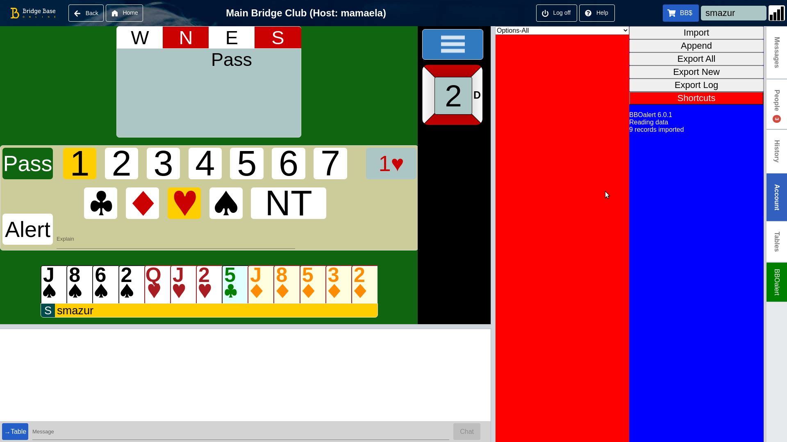

# Script library

The scriptLib.js file contains functions that can be used in BBOalert data.

To load the library the data should contain the record :

    //Javascript,https://raw.githubusercontent.com/stanmaz/BBOalert/master/Scripts/stanmazLib.js
    
The library contains functions modifying the BBO user interface. With each feature an inline script is presented enabling this feature.
 
## Features

### Hover tabs

    //Script,onDataLoad,stanmazLib.HOVER_BBOALERT_TAB(true);
    
HOVER_BBOALERT_TAB function enables toggeling the BBOalert tab by simply moving the mouse :

- BBOalert tab is displayed when the mouse pointer enters it
- BBOalert tab is hidden when the mouse pointer enters a BBO tab

### Card Colors

    //Script,onAnyMutation,stanmazLib.CARD_COLORS(true);
    
CARD_COLORS function modifies card symbol colors to help color blind players.

The effect :

### Rearrange the table

    //Script,onAnyMutation,stanmazLib.DEAL_TOOLBAR_RIGHT();
    
The table is moved to the left side of the screen leaving more space.

The effect can be seen in the "Card colors" section.

### Remove icons from tabs

    //Script,onAnyMutation,stanmazLib.REMOVE_ICONS_FROM_TABS();

The icons occupy space on the tabs. This can prevent in some cases BBOalert tab to be displayed correctly.

The effect can be seen in the "Card colors" section.

  
